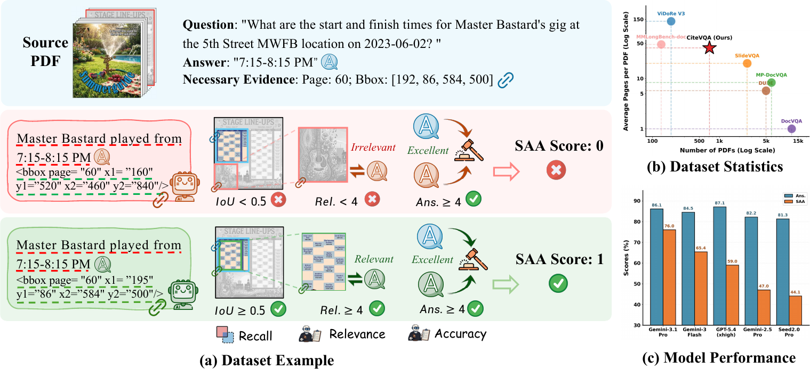
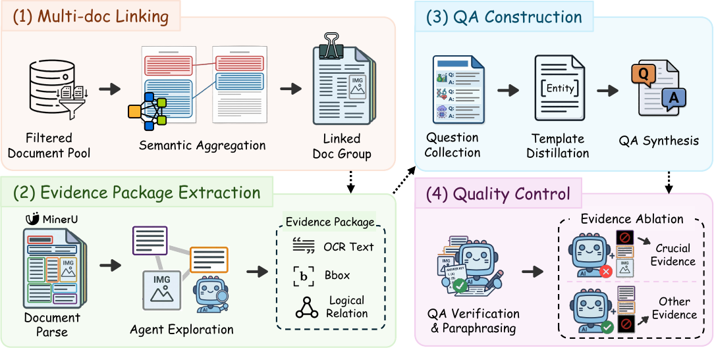

# CiteVQA: Benchmarking Evidence Attribution for Trustworthy Document Intelligence

<p align="center">
  <a href="https://huggingface.co/datasets/opendatalab/CiteVQA"></a>
  <a href="https://www.modelscope.cn/datasets/OpenDataLab/CiteVQA"></a>
  <a href="./LICENSE.txt"></a>
  <a href="./README_zh.md"></a>
</p>

<p align="center">
  <b>If you like our project, please give us a star ⭐ on GitHub for the latest update.</b>
</p>

---
## 🔎 Overview

**CiteVQA** is a document visual question answering benchmark for **faithful evidence attribution**. Unlike conventional DocVQA datasets that only score the final answer, CiteVQA requires a model to answer a question with evidence grounded in the source document at the **element level**. The benchmark is designed to evaluate whether a system can not only answer correctly, but also cite the right supporting region in long, real-world PDFs.

The dataset contains **1,897 questions** built from **711 PDFs** across **7 macro-domains** and **30 sub-domains**, with an average of **40.6 pages per document**. It covers both **English** and **Chinese** documents, and includes **single-document** as well as **multi-document** settings.

The evaluation covers three dataset types:

- **Single-Doc**: Single-document question answering.
- **Multi (1-Gold)**: Multi-document QA with exactly one gold document.
- **Multi (N-Gold)**: Multi-document QA with multiple gold documents.

<p align="center">
  
</p>
<p align="center">
  <em>CiteVQA jointly audits answer correctness and evidence attribution.</em>
</p>


## ✨ Highlights

- **Joint answer-and-evidence evaluation**: CiteVQA is built for evaluating both answer correctness and citation faithfulness.
- **Element-level evidence**: Ground-truth evidence is provided as structured elements with bounding boxes, page indices, and document indices.
- **Long-document setting**: Documents are multi-page PDFs with realistic length and layout complexity.
- **Cross-domain and bilingual**: The benchmark spans **7 domains**, **30 sub-domains**, and two languages (`en`, `zh`).
- **Multi-document reasoning**: In addition to single-document QA, the dataset includes cross-document questions requiring evidence aggregation.
- **Three evaluation settings**: The benchmark covers `Single-Doc`, `Multi (1-Gold)`, and `Multi (N-Gold)` setups.

## 🧱 Pipeline

CiteVQA is built with an automated pipeline that links documents, extracts evidence packages, synthesizes question-answer pairs, and validates crucial evidence for attribution-aware evaluation.

<p align="center">
  
</p>
<p align="center">
  <em>Automated pipeline for document collection, evidence extraction, QA construction, and quality control.</em>
</p>

## ⚙️ Setup

Install dependencies:

```bash
pip install -r requirements.txt
```

Optional CJK font configuration for PDF rendering:

<details>
<summary>Expand font setup for Chinese PDFs</summary>

```bash
apt install fonts-noto-cjk poppler-data

cat > /etc/fonts/conf.d/99-pdf-cjk.conf << 'EOF'
<?xml version="1.0"?>
<!DOCTYPE fontconfig SYSTEM "fonts.dtd">
<fontconfig>
  <alias><family>STSong-Light</family><prefer><family>Noto Serif CJK SC</family></prefer></alias>
  <alias><family>STSong</family><prefer><family>Noto Serif CJK SC</family></prefer></alias>
  <alias><family>SimSun</family><prefer><family>Noto Serif CJK SC</family></prefer></alias>
  <alias><family>FangSong</family><prefer><family>Noto Serif CJK SC</family></prefer></alias>
  <alias><family>KaiTi</family><prefer><family>Noto Serif CJK SC</family></prefer></alias>
  <alias><family>SimHei</family><prefer><family>Noto Sans CJK SC</family></prefer></alias>
  <alias><family>Microsoft YaHei</family><prefer><family>Noto Sans CJK SC</family></prefer></alias>
</fontconfig>
EOF

fc-cache -f
```

</details>

## 📦 Data

From the repository root, you can fetch the benchmark files from Hugging Face into `data/`, then download the source PDFs:

```bash
pip install -U "huggingface_hub[cli]"
hf download opendatalab/CiteVQA --repo-type dataset --local-dir data
python data/download/download_pdfs.py --workers 16 --out data/pdf --csv data/download/pdf_source.csv
```

From the repository root, you can also fetch the benchmark files from ModelScope into `data/`, then download the source PDFs:

```bash
pip install -U modelscope
modelscope download --dataset OpenDataLab/CiteVQA --local_dir data
python data/download/download_pdfs.py --workers 16 --out data/pdf --csv data/download/pdf_source.csv
```

Alternatively, if you want to download the benchmark files via Kaggle and then fetch the source PDFs in batch, run:

```bash
kaggle datasets download anonymouscitevqa/citevqa -p data --unzip
python data/download/download_pdfs.py --workers 16 --out data/pdf --csv data/download/pdf_source.csv
```

The PDF downloader reads `data/download/pdf_source.csv` and saves all files to `data/pdf/`.

| Option | Default | Description |
| --- | --- | --- |
| `--csv` | `pdf_source.csv` | CSV file containing PDF URLs |
| `--out` | `pdf` | Output directory |
| `--workers` | `16` | Concurrent download workers |
| `--timeout` | `120` | Timeout per file in seconds |
| `--retries` | `3` | Retry count |
| `--no-skip` | - | Re-download existing files |

## 🚀 Inference and Evaluation

Edit API settings in `run.sh`, then run:

```bash
bash run.sh
```

Reference workflow:

```bash
# API config
API_TYPE=openai
API_KEY=YOUR_API_KEY
BASE_URL=YOUR_BASE_URL

# Inference
python infer/run.py \
  --api ${API_TYPE} \
  --model MODEL_NAME \
  --base_url ${BASE_URL} \
  --api_key ${API_KEY} \
  --workers 4 \
  --out outputs/infer/MODEL_NAME.json

# Evaluation
python eval/run.py \
  --judge_api ${API_TYPE} \
  --judge_model JUDGE_MODEL_NAME \
  --judge_api_key ${API_KEY} \
  --base_url ${BASE_URL} \
  --input outputs/infer/MODEL_NAME.json \
  --out outputs/eval/MODEL_NAME.json \
  --workers 24

# Summary
python eval/summarize.py \
  --input outputs/eval/MODEL_NAME.json \
  --out_dir outputs/eval/MODEL_NAME
```

### 🧭 Inference Arguments

| Option | Required | Description |
| --- | --- | --- |
| `--api` | Yes | `openai`, `genai`, or `anthropic` |
| `--model` | Yes | Model name |
| `--api_key` | Yes | API key |
| `--base_url` | No | API base URL |
| `--workers` | No | Number of workers, default `4` |
| `--out` | No | Output JSON path |
| `--benchmark` | No | Benchmark path, default `data/data_items.json` |
| `--limit` | No | Sample limit, `0` means all |
| `--max_pdf_mb` | No | Compress PDFs larger than this size in MB |

### 📏 Evaluation Arguments

| Option | Required | Description |
| --- | --- | --- |
| `--input` | Yes | Inference output JSON |
| `--judge_api` | No | Judge API type, default `openai` |
| `--judge_model` | No | Judge model name, default `gpt-4o` |
| `--judge_api_key` | Yes | Judge API key |
| `--base_url` | No | API base URL |
| `--metrics` | No | Metrics list, default `recall,rel` |
| `--workers` | No | Number of workers |
| `--out` | No | Output JSON path |
| `--limit` | No | Sample limit |

## 🗂️ Repository Structure

```text
CiteVQA/
├── data/
│   ├── data_items.json          # Benchmark QA pairs
│   ├── pdf/                     # Downloaded PDFs
│   └── download/
│       ├── pdf_source.csv       # PDF metadata & URLs
│       └── download_pdfs.py     # PDF download script
├── infer/
│   └── run.py                   # Inference script
├── eval/
│   ├── run.py                   # Evaluation script
│   └── summarize.py             # Summary table generator
├── prompts/                     # System & user prompts
├── outputs/                     # Inference & evaluation outputs
├── requirements.txt
└── run.sh                       # Demo script
```

## 📊 Evaluation Metrics

| Metric | Meaning |
| --- | --- |
| `Recall` | Whether predicted evidence overlaps with crucial ground-truth evidence |
| `Relevance (Rel.)` | Whether the cited evidence semantically supports the answer |
| `Answer Correctness (Ans.)` | Whether the answer is correct |
| `SAA` | Strict Attributed Accuracy: answer and evidence must both be valid |
| `Page Recall` | Whether the correct page is identified |
| `Precision / F1` | Precision and overlap quality of predicted evidence |

`SAA` is the core metric of CiteVQA.

## 🏆 Evaluation Result

We evaluated 20 state-of-the-art MLLMs on CiteVQA using a unified prompt template. The results show that faithful evidence attribution remains substantially harder than answer-only scoring.

- **Best overall SAA**: `Gemini-3.1-Pro-Preview` reaches **76.0** SAA with **86.1** answer score.
- **Best answer accuracy**: `GPT-5.4` reaches **87.1** answer score, but its SAA drops to **59.0**.
- **Best open-source model**: `Qwen3-VL-235B-A22B` reaches **22.5** SAA with **72.3** answer score.
- **Key finding**: a large gap between `Ans.` and `SAA` appears across models, highlighting the benchmark's `Attribution Hallucination` challenge.

Full overall results:

| Model | Category | Rec. | Rel. | Ans. | SAA |
| --- | --- | ---: | ---: | ---: | ---: |
| Gemini-3.1-Pro-Preview | Closed-source MLLMs | 66.0 | 83.6 | 86.1 | 76.0 |
| Gemini-3-Flash-Preview | Closed-source MLLMs | 45.4 | 75.7 | 84.5 | 65.4 |
| GPT-5.4 | Closed-source MLLMs | 31.0 | 67.5 | 87.1 | 59.0 |
| Gemini-2.5-Pro | Closed-source MLLMs | 27.4 | 59.8 | 82.2 | 47.0 |
| Seed2.0-Pro | Closed-source MLLMs | 28.5 | 54.9 | 81.3 | 44.1 |
| GPT-5.2 | Closed-source MLLMs | 18.2 | 56.6 | 71.5 | 33.7 |
| Qwen3.6-Plus | Closed-source MLLMs | 7.7 | 25.0 | 85.9 | 17.5 |
| GLM-5V-Turbo | Closed-source MLLMs | 14.9 | 29.2 | 49.6 | 12.8 |
| Qwen3-VL-235B-A22B | Open-source Large MLLMs | 11.3 | 35.3 | 72.3 | 22.5 |
| Gemma-4-31B | Open-source Large MLLMs | 11.6 | 35.0 | 69.8 | 20.2 |
| Kimi-K2.5 | Open-source Large MLLMs | 6.2 | 26.8 | 74.3 | 19.1 |
| Qwen3.5-397B-A17B | Open-source Large MLLMs | 5.4 | 24.6 | 76.5 | 18.3 |
| Qwen3.5-27B | Open-source Large MLLMs | 5.3 | 25.3 | 75.6 | 17.3 |
| Qwen3-VL-32B | Open-source Large MLLMs | 6.6 | 30.5 | 72.3 | 17.3 |
| Qwen3.5-122B-A10B | Open-source Large MLLMs | 3.9 | 19.0 | 73.6 | 14.8 |
| Qwen3.5-9B | Open-source Small MLLMs | 1.6 | 14.7 | 65.0 | 11.1 |
| Qwen3.5-35B-A3B | Open-source Small MLLMs | 1.7 | 13.7 | 76.4 | 10.7 |
| Qwen3-VL-30B-A3B | Open-source Small MLLMs | 3.5 | 14.6 | 62.2 | 8.2 |
| Qwen3-VL-8B | Open-source Small MLLMs | 1.0 | 14.7 | 61.2 | 7.5 |
| Gemma-4-26B-A4B | Open-source Small MLLMs | 3.0 | 17.9 | 48.4 | 6.2 |


## 📚 Citation

```bibtex
@article{ma2026citevqa,
  title={CiteVQA: Benchmarking Evidence Attribution for Trustworthy Document Intelligence},
  author={Dongsheng Ma and Jiayu Li and Zhengren Wang and Yijie Wang and Jiahao Kong and Weijun Zeng and Jutao Xiao and Jie Yang and Wentao Zhang and Bin Wang and Conghui He},
  year={2026}
}
```

## 📄 License

This project is licensed under the MIT License. See the [LICENSE](./LICENSE) file for details.
